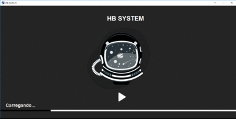

<h1>Sistema Operacional</h1>

<h2>Bem vindo(ao) meu repositório</h2>

>Status do projeto: Em Desenvolvimento

## Descrição do projeto
 

Olá, seja muito bem-vindo(a), meu nome é Habacuque Gosch, e esse projeto foi desenvolvido com o intuito de simular
um sistema operacional assim como o windows ou linux. Bem o sistema ele já vem com alguns programas básicos que
eu mesmo desenvolvi assim como: calculadora, lixeira, e o jogo snake. 

    
## Funcionalidades

:heavy_check_mark: `Funcionalidade 1:` simular um sistema operacional 

:heavy_check_mark: `Funcionalidade 2:` Trocar nome de usuario
    
:heavy_check_mark: `Funcionalidade 3:` Trocar foto de usuario
    
:heavy_check_mark: `Funcionalidade 2:` acessar/rodar/importa programas(pelo própio codigo fonte)

<video width="420" height="340" controls="controls">
    <source src="./filme.mp4" type="video/mp4">
</video>
 

    <h1>HB System<h1>
    

            
## Ferramentas utilizadas

 
    
### Você também me encontra em:
&nbsp;&nbsp;
&nbsp;&nbsp;
    
<h2>Guia</h2>

para rodar esse projeto em sua máquina, favor clonar o repositório

Logo após ter clonado(baixado), coloque o projeto em uma unica pasta com o nome "sistema operacional"
